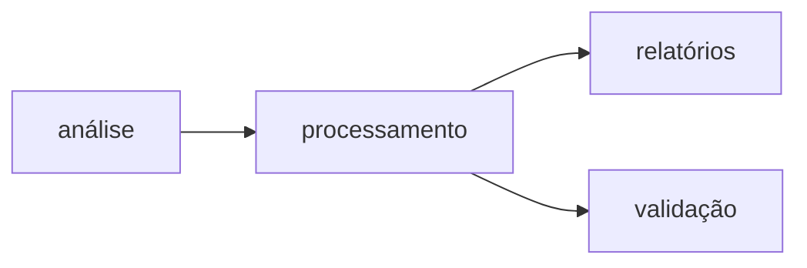

# Harmonização do nome de coletores de amostras de herbário e coleções biológicas no Brasil - Biodiversidade Online

Este projeto implementa um algoritmo para canonicalização de nomes de coletores de amostras biológicas botânicas e zoológicas, processando dados armazenados em MongoDB.

## Projeto Relacionado

Este projeto está associado ao [DarwinCoreJSON](https://github.com/biopinda/DarwinCoreJSON), um sistema para conversão de dados de biodiversidade para o padrão Darwin Core em formato JSON. O **coletores-BO** atua como um componente de melhoria da qualidade dos dados, especificamente focado na normalização e canonicalização dos nomes de coletores no banco de dados gerado pelo DarwinCoreJSON, aumentando a consistência e facilitando análises posteriores.

## Principais Funcionalidades

### 🔬 Análise Completa do Dataset
- **Processamento completo**: TODOS os registros com recordedBy (11M+ registros)
- **Análise abrangente**: Descobre padrões de toda a base de dados
- **Especialização detectada**: Identifica coletores especializados em botânica ou zoologia
- **Configuração dinâmica**: Thresholds otimizados baseados no dataset completo

### 🏛️ Sistema de Classificação de Entidades
- **Seis categorias inteligentes**:
  - `pessoa`: Um único nome próprio de pessoa
  - `conjunto_pessoas`: Múltiplos nomes próprios (para atomização)
  - `grupo_pessoas`: Denominações genéricas sem nomes próprios
  - `empresa_instituicao`: Organizações, empresas, instituições
  - `coletor_indeterminado`: Coletores não identificados (ex: "?", "Sem coletor")
  - `representacao_insuficiente`: Apenas nome ou iniciais (ex: "João", "S.A.")
- **Detecção automática**: Reconhece acrônimos, códigos de herbário, instituições
- **Índice de confiança**: Score de 0.0 a 1.0 para cada classificação
- **Padrões avançados**: Detecta "EMBRAPA", "Pesquisas da Biodiversidade", "USP", etc.
- **Classificação assistida**: Suporte para revisão manual de casos de baixa confiança

### 📊 Sistema de Canonicalização Avançado
- **Algoritmo de similaridade**: Combina análise fonética, inicial e sobrenome
- **Scoring inteligente**: Calcula confiança na canonicalização
- **Revisão automática**: Identifica casos que necessitam validação manual

## Visão Geral

O algoritmo resolve o problema de múltiplas representações do mesmo coletor (ex: "FORZZA", "Forzza, R." e "R.C. Forzza") através de:

1. **Atomização**: Separação de múltiplos coletores em uma string
2. **Normalização**: Padronização de cada nome individual
3. **Canonicalização**: Agrupamento de variações da mesma pessoa

## Estrutura do Projeto

```
coletores-BO/
├── src/                          # Código fonte
│   ├── canonicalizador_coletores.py  # Classes principais do algoritmo
│   ├── analise_coletores.py          # Script de análise completa (11M+ registros)
│   ├── processar_coletores.py        # Script de processamento principal
│   ├── validar_canonicalizacao.py    # Script de validação de qualidade
│   ├── gerar_relatorios.py           # Script de geração de relatórios
│   ├── cli/                          # Interface CLI unificada
│   │   ├── __main__.py              # Entry point principal
│   │   └── commands/                # Comandos CLI individuais
│   ├── services/                     # Serviços de apoio
│   │   ├── checkpoint_manager.py    # Gerenciamento de checkpoints
│   │   ├── report_generator.py      # Geração de relatórios avançados
│   │   ├── validation_service.py    # Validação de qualidade
│   │   └── performance_monitor.py   # Monitoramento de performance
│   └── models/                       # Modelos de dados
├── config/                       # Configurações
│   └── mongodb_config.py            # Configuração do MongoDB e algoritmo
├── tests/                        # Testes automatizados
│   ├── contract/                    # Testes de contrato
│   ├── integration/                 # Testes de integração
│   └── unit/                        # Testes unitários
├── specs/                        # Especificações do projeto
├── logs/                         # Arquivos de log
├── reports/                      # Relatórios gerados (.txt)
├── requirements.txt              # Dependências Python
├── pyproject.toml               # Configuração do projeto Python
└── README.md                     # Esta documentação
```

## Instalação

### Pré-requisitos
- Python 3.11+
- MongoDB 4.4+
- 8GB+ RAM (recomendado para processamento completo)

### Instalação Rápida

1. **Clonar repositório**:
```bash
git clone https://github.com/biopinda/coletores-BO.git
cd coletores-BO
```

2. **Instalar dependências**:
```bash
pip install -r requirements.txt
```

3. **Configurar MongoDB**:
```bash
# Criar arquivo .env com string de conexão
echo "MONGODB_CONNECTION_STRING=mongodb://localhost:27017" > .env

# Ou configurar em config/mongodb_config.py
# Banco: dwc2json
# Coleção principal: ocorrencias (com campo recordedBy)
```

4. **Verificar instalação**:
```bash
python -m src.cli status --detailed
```

## Uso

### Sistema de Execução

O sistema oferece **duas formas de execução**: através da **Interface CLI Unificada** (recomendada) ou dos **Scripts Individuais** (tradicional).

### 🚀 INTERFACE CLI UNIFICADA (RECOMENDADA)

A nova interface CLI oferece execução orquestrada, monitoramento de performance, validação de dependências e execução em ordem correta automaticamente.

#### Comandos Disponíveis

```bash
# Verificar status do sistema
python -m src.cli status --detailed

# Executar pipeline completo (RECOMENDADO)
python -m src.cli pipeline --full-process

# Executar comandos individuais
python -m src.cli analyze --save-patterns
python -m src.cli process --analysis-results analysis.json
python -m src.cli reports --include-analysis
python -m src.cli validate --baseline-analysis analysis.json

# Ajuda para qualquer comando
python -m src.cli --help
python -m src.cli [comando] --help
```

#### ⚠️ ORDEM CORRETA DE EXECUÇÃO (AUTOMATIZADA)

**CRÍTICO**: A ordem de execução é **OBRIGATÓRIA** e é automaticamente validada pela CLI:



**Sequência obrigatória**:
1. **Análise** → Descobre padrões de TODOS os registros (análise completa)
2. **Processamento** → Aplica padrões descobertos para canonicalização
3. **Relatórios** → Gera relatórios .txt com insights da análise
4. **Validação** → Valida qualidade contra baseline da análise completa

#### Execução Pipeline Completo

```bash
# Pipeline completo com monitoramento de performance
python -m src.cli pipeline --full-process --performance-monitoring

# Pipeline com configurações personalizadas
python -m src.cli pipeline \
    --batch-size 2000 \
    --quality-threshold 0.90 \
    --output-dir final_results \
    --generate-final-report
```

#### Execução Comandos Individuais

```bash
# 1. ANÁLISE: Descoberta de padrões de TODOS os registros (OBRIGATÓRIO PRIMEIRO)
python -m src.cli analyze \
    --full-dataset \
    --save-patterns \
    --output-format txt

# 2. PROCESSAMENTO: Canonicalização com padrões descobertos
python -m src.cli process \
    --analysis-results patterns_discovered_*.txt \
    --batch-size 5000 \
    --enable-checkpoints

# 3. RELATÓRIOS: Geração em formato .txt com insights da análise
python -m src.cli reports \
    --analysis-results complete_analysis_results_*.txt \
    --include-analysis \
    --format txt

# 4. VALIDAÇÃO: Qualidade contra baseline da análise completa
python -m src.cli validate \
    --baseline-analysis complete_analysis_results_*.txt \
    --quality-threshold 0.85 \
    --generate-report
```

### 📜 SCRIPTS INDIVIDUAIS (TRADICIONAL)

Para usuários avançados ou sistemas automatizados, os scripts individuais continuam disponíveis:

| Script | Descrição | Documentação |
|--------|-----------|--------------|
| `canonicalizador_coletores.py` | **Módulo central** - Classes principais do algoritmo | Usado pelos outros scripts |
| `analise_coletores.py` | Análise exploratória dos dados | [📖 Documentação](docs/analise_coletores.md) |
| `processar_coletores.py` | Processamento principal e canonicalização | [📖 Documentação](docs/processar_coletores.md) |
| `validar_canonicalizacao.py` | Validação de qualidade dos resultados | [📖 Documentação](docs/validar_canonicalizacao.md) |
| `gerar_relatorios.py` | Geração de relatórios detalhados | [📖 Documentação](docs/gerar_relatorios.md) |

#### Execução Scripts Individuais

```bash
# 1. PRIMEIRO: Análise completa de TODOS os registros (OBRIGATÓRIO)
cd src
python analise_coletores.py  # Processa todos os registros, gera relatórios .txt

# 2. SEGUNDO: Processamento principal (requer análise)
python processar_coletores.py --analysis-results reports/complete_analysis_results_*.txt

# 3. TERCEIRO: Validação da qualidade
python validar_canonicalizacao.py --baseline-analysis reports/complete_analysis_results_*.txt

# 4. QUARTO: Geração de relatórios detalhados
python gerar_relatorios.py --analysis-results reports/complete_analysis_results_*.txt
```

### ⚠️ CRITÍCO: Dependência de Análise

**TODOS os scripts dependem dos resultados da análise completa**:

- ✅ **Análise primeiro**: Processa TODOS os registros com recordedBy para descobrir padrões ótimos
- ✅ **Padrões dinâmicos**: Thresholds e configurações são descobertos automaticamente
- ✅ **Qualidade superior**: Processamento usa insights do dataset completo
- ✅ **Relatórios em .txt**: Todos os relatórios gerados em formato texto legível
- ❌ **Não pular análise**: Sem análise = configurações estáticas = qualidade inferior

### 🎯 Vantagens da Interface CLI

#### ✅ Orquestração Automatizada
- **Ordem de execução validada**: Impede execução fora de ordem
- **Dependências verificadas**: Automaticamente verifica arquivos de análise
- **Pipeline completo**: Um comando executa toda a sequência

#### ✅ Monitoramento Avançado
- **Performance em tempo real**: CPU, memória, I/O durante execução
- **Progress tracking**: Acompanha progresso de cada etapa
- **Logs unificados**: Centraliza logs de todas as etapas

#### ✅ Gerenciamento de Configuração
- **Configuração centralizada**: Um arquivo controla todo o sistema
- **Validação de settings**: Verifica parâmetros antes da execução
- **Environment variables**: Suporte a variáveis de ambiente

#### ✅ Tratamento de Erros
- **Recuperação inteligente**: Detecta e sugere correções para erros
- **Checkpoints automáticos**: Permite retomar execuções interrompidas
- **Validação pré-execução**: Verifica sistema antes de iniciar processamento

#### ✅ Relatórios Integrados
- **Sumário de pipeline**: Relatório unificado de toda execução
- **Métricas de qualidade**: Acompanha qualidade ao longo do processo
- **Exportação de resultados**: Formatos múltiplos (JSON, HTML, CSV)

### 1. Análise Completa do Dataset

**PRIMEIRO PASSO OBRIGATÓRIO**: Execute uma análise de TODOS os registros:

```bash
cd src
python analise_coletores.py  # Processa TODOS os registros com recordedBy
```

**Características da análise completa**:
- ✅ **Processamento integral**: TODOS os registros (11M+) são analisados
- ✅ **Sistema de classificação com 6 categorias**: pessoa, conjunto_pessoas, grupo_pessoas, empresa_instituicao, coletor_indeterminado, representacao_insuficiente
- ✅ **Descoberta dinâmica de padrões**: Separadores, thresholds e configurações otimizados
- ✅ **Índice de confiança**: Score de 0.0 a 1.0 para cada classificação
- ✅ **Detecção avançada**: Empresas/instituições (ex: "EMBRAPA", "USP", "RB")
- ✅ **Análise por reino**: Distribuição Plantae/Animalia
- ✅ **Baseline completo**: Estatísticas para validação posterior

**Saída**: Relatórios .txt em `reports/` com:
- `analise_completa_*.txt`: Relatório principal com estatísticas completas
- `patterns_discovered_*.txt`: Padrões descobertos (separadores, thresholds)
- `optimal_thresholds_*.txt`: Configurações otimizadas para processamento
- `complete_analysis_results_*.txt`: Resultados completos para fases seguintes

**Conteúdo dos relatórios**:
- Distribuição por 6 tipos de entidade
- Estatísticas de confiança na classificação
- Distribuição de formatos de nomes por reino
- Separadores descobertos automaticamente
- Exemplos classificados por tipo com score de confiança
- Caracteres especiais identificados
- Thresholds otimizados baseados no dataset completo

### 2. Processamento Principal

Execute a canonicalização de todos os dados:

```bash
# Processamento completo (11M registros)
python processar_coletores.py

# Reiniciar do zero (limpa dados existentes)
python processar_coletores.py --restart

# Ver casos que precisam revisão manual
python processar_coletores.py --revisao
```

**Melhorias implementadas**:
- ✅ Suporte a análise por kingdom (Plantae/Animalia)
- ✅ Identificação de tipos: pessoa vs grupo/projeto
- ✅ Estrutura expandida com estatísticas por reino

**Características**:
- Processamento em lotes (10k registros por vez)
- Sistema de checkpoint para recuperação
- Logging verboso
- Interrupção controlada (Ctrl+C)

### 3. Validação

Valide a qualidade da canonicalização:

```bash
# Validação completa
python validar_canonicalizacao.py

# Exportar amostra para revisão manual
python validar_canonicalizacao.py --csv validacao_manual.csv
```

**Funcionalidades de validação**:
- Análise de qualidade por kingdom
- Detecção de especialização de coletores
- Identificação de casos problemáticos
- Recomendações automatizadas

### 4. Relatórios

Gere relatórios detalhados:

```bash
# Todos os relatórios
python gerar_relatorios.py

# Relatório específico
python gerar_relatorios.py --tipo estatisticas
python gerar_relatorios.py --tipo top --top-n 50
python gerar_relatorios.py --tipo csv
```

**Novos tipos de relatório**:
- Análise comparativa por kingdom
- Coletores especialistas vs generalistas
- Estatísticas de grupos/projetos
- Métricas de qualidade avançadas

## Sistema de Classificação de Entidades

### 📋 Quatro Categorias Inteligentes

O algoritmo classifica cada entrada de coletor em uma das quatro categorias:

#### 1. `pessoa` - Pessoa Individual
Nomes próprios de uma única pessoa:
- Exemplos: `"G.A. Damasceno-Junior"`, `"Amaral, AG"`, `"João Santos"`
- **Tratamento**: Canonicalizado diretamente
- **Características**: Um único nome próprio com possíveis iniciais

#### 2. `conjunto_pessoas` - Múltiplos Nomes Próprios
Strings contendo múltiplos nomes próprios que serão atomizados:
- Exemplos: `"Gonçalves, J.M.; A.O.Moraes, LSantiago"`, `"Silva, J.; Santos, M.; et al."`
- **Tratamento**: Atomizado em pessoas individuais
- **Características**: Contém nomes próprios separados por `;`, `&`, ou `et al.`

#### 3. `grupo_pessoas` - Denominações Genéricas
Denominações de grupos SEM nomes próprios específicos:
- Exemplos: `"Alunos da disciplina de botânica"`, `"Equipe de pesquisa de campo"`
- **Tratamento**: Mantido como grupo genérico
- **Características**: Palavras descritivas sem nomes próprios

#### 4. `empresa_instituicao` - Organizações
Empresas, universidades, instituições e códigos:
- Exemplos: `"EMBRAPA"`, `"Universidade Federal do Rio de Janeiro"`, `"RB"`
- **Tratamento**: Canonicalizado como entidade institucional
- **Características**: Acrônimos, códigos de herbário, nomes institucionais

### 🎯 Vantagens da Classificação

- **Processamento otimizado**: Cada tipo recebe tratamento específico
- **Qualidade melhorada**: Evita misturar pessoas com instituições
- **Atomização inteligente**: Separa automaticamente conjuntos de pessoas
- **Suporte a grupos**: Preserva denominações genéricas importantes

## Algoritmo

### 📖 Documentação Técnica Detalhada

Para uma análise completa dos algoritmos e estratégias utilizadas, consulte:

- **[📘 Algoritmos de Canonicalização](docs/ALGORITMOS_CANONICALIZACAO.md)** - Documentação técnica completa sobre:
  - Estratégias de atomização e separação de nomes múltiplos
  - Algoritmos de similaridade (Levenshtein, Soundex, Metaphone)
  - Sistema de classificação de entidades com machine learning
  - Técnicas de agrupamento e canonicalização
  - Otimizações de performance e índices MongoDB
  - Métricas de qualidade e validação

### Classes Principais

#### `AtomizadorNomes`
- Separa múltiplos coletores usando padrões regex
- Suporta separadores: `&`, `e`, `and`, `;`, `et al.`, `e col.`, etc.
- Valida nomes resultantes

#### `NormalizadorNome`
- Extrai componentes: sobrenome, iniciais, nome completo
- Gera chaves de busca fonética (Soundex, Metaphone)
- Normaliza para comparação

#### `CanonizadorColetores`
- Agrupa variações do mesmo coletor
- Calcula similaridade usando:
  - Sobrenome (peso 50%)
  - Compatibilidade de iniciais (peso 30%)
  - Similaridade fonética (peso 20%)
- Score de confiança para agrupamento

#### `GerenciadorMongoDB`
- Interface com banco de dados
- Operações em lote otimizadas
- Sistema de checkpoint
- Índices para busca eficiente

### Estrutura da Coleção `coletores`

```json
{
  "_id": ObjectId("..."),
  "coletor_canonico": "Forzza, R.C.",
  "sobrenome_normalizado": "forzza",
  "iniciais": ["R", "C"],
  "variacoes": [
    {
      "forma_original": "FORZZA",
      "frequencia": 1250,
      "primeira_ocorrencia": ISODate("..."),
      "ultima_ocorrencia": ISODate("...")
    }
  ],
  "total_registros": 4200,
  "confianca_canonicalizacao": 0.95,
  "kingdoms": {
    "Plantae": 2800,
    "Animalia": 1400
  },
  "tipo_coletor": "pessoa",  // "pessoa", "conjunto_pessoas", "grupo_pessoas" ou "empresa_instituicao"
  "confianca_tipo_coletor": 0.85,  // Confiança na classificação do tipo (0.0-1.0)
  "metadados": {
    "data_criacao": ISODate("..."),
    "ultima_atualizacao": ISODate("..."),
    "algoritmo_versao": "1.0",
    "revisar_manualmente": false
  },
  "indices_busca": {
    "soundex": "F620",
    "metaphone": "FRTS"
  }
}
```

## Configuração

### Parâmetros Principais (`config/mongodb_config.py`)

- `similarity_threshold`: 0.85 (limiar de similaridade para agrupamento)
- `confidence_threshold`: 0.7 (limiar de confiança automática)
- `batch_size`: 5000 (registros por lote - otimizado para análise completa)
- `checkpoint_interval`: 25000 (checkpoint a cada 25k registros)
- `analysis_complete`: True (processa TODOS os registros, não amostra)

### Descoberta Dinâmica de Padrões

A análise completa identifica automaticamente:
- **Separadores mais comuns**: Descobertos na análise de todos os registros
- **Thresholds otimizados**: Baseados na distribuição real do dataset
- **Padrões específicos**: Instituições, códigos de herbário, acrônimos
- **Configurações adaptadas**: Ajustadas para o perfil específico dos dados

**Padrões base identificados**:
- `&`, `e`, `and` (conjunções)
- `;` (separador formal)
- `, + maiúscula` (separador com nome)
- `et al.`, `e col.` (indicadores de grupo)
- Padrões institucionais (EMBRAPA, USP, RB, etc.)

## Logs

Todos os scripts geram logs detalhados em `logs/`:
- `analise_exploratoria.log`
- `processamento.log`
- `validacao.log`
- `relatorios.log`

## Performance

### Estimativas (Análise Completa de TODOS os registros)

- **Análise completa**: 8-12 horas (primeira execução, processa tudo)
- **Processamento subsequente**: 4-6 horas (usa padrões descobertos)
- **Performance otimizada**: ~1000+ registros/segundo (após otimizações)
- **Memória**: ~4-8GB RAM (recomendado para análise completa)
- **Armazenamento**: ~8-12GB adicional no MongoDB
- **Relatórios**: Arquivos .txt legíveis (não JSON)

### Otimizações da Nova Arquitetura

- **Análise completa primeiro**: Evita reprocessamento desnecessário
- **Processamento em lotes otimizados**: 5k registros/lote
- **Índices MongoDB especializados**: Criados baseados na análise
- **Cache inteligente**: Canonização usa padrões descobertos
- **Checkpoints hierárquicos**: Macro, micro e batch level
- **Relatórios .txt**: Formato legível e compatível com qualquer editor
- **Services modulares**: Checkpoint, reporting e validation independentes

## 📄 Relatórios em Formato TXT

### Mudança Importante: Relatórios Legíveis

**TODOS os relatórios agora são gerados em formato .txt** para melhor legibilidade:

#### Tipos de Relatórios Gerados

1. **`analise_completa_YYYYMMDD_HHMMSS.txt`**
   - Relatório principal da análise completa
   - Estatísticas detalhadas por reino e categoria
   - Distribuição de padrões descobertos
   - Métricas de qualidade e confiança

2. **`patterns_discovered_YYYYMMDD_HHMMSS.txt`**
   - Padrões de separadores identificados
   - Frequência de cada padrão
   - Scores de qualidade dos padrões

3. **`optimal_thresholds_YYYYMMDD_HHMMSS.txt`**
   - Thresholds otimizados para processamento
   - Recomendações de configuração
   - Parâmetros ajustados automaticamente

4. **`complete_analysis_results_YYYYMMDD_HHMMSS.txt`**
   - Resultados consolidados para próximas fases
   - Baseline completo para validação
   - Hash de configuração para controle de versão

### Vantagens dos Relatórios TXT

- ✅ **Legibilidade**: Facilmente abertos em qualquer editor
- ✅ **Versionamento**: Compatível com git diff
- ✅ **Auditoria**: Fácil revisão manual dos resultados
- ✅ **Debugging**: Análise rápida de problemas
- ✅ **Portabilidade**: Funciona em qualquer sistema

## Monitoramento

### Métricas de Qualidade

- Taxa de canonicalização (variações/coletor)
- Distribuição de confiança
- Casos que precisam revisão manual
- Inconsistências detectadas

### Relatórios Disponíveis

1. **Estatísticas Gerais**: Visão geral do processamento
2. **Top Coletores**: Coletores mais frequentes
3. **Qualidade**: Casos problemáticos e recomendações
4. **Variações**: Análise de padrões de nomes
5. **CSV Export**: Dados para análise externa

## Manutenção

### Revisão Manual

Casos marcados para revisão manual (`revisar_manualmente: true`):
- Confiança < 0.5
- Muitas variações com baixa confiança
- Sobrenomes inconsistentes

### Ajuste de Parâmetros

Para melhorar qualidade:
- Reduzir `similarity_threshold` (mais agrupamento)
- Aumentar `confidence_threshold` (mais revisão manual)
- Adicionar novos padrões de separação

## Troubleshooting

### Problemas Comuns

1. **Conexão MongoDB**:
   ```
   Erro: ServerSelectionTimeoutError
   ```
   - Verificar string de conexão
   - Confirmar acesso à rede

2. **Memória insuficiente**:
   - Reduzir `batch_size`
   - Aumentar RAM disponível

3. **Processamento lento**:
   - Verificar índices MongoDB
   - Ajustar `batch_size`

### Logs de Debug

Para mais detalhes, alterar nível de log:
```python
logging.basicConfig(level=logging.DEBUG)
```

## Desenvolvimento

### Extensões Futuras

1. **Algoritmos de similaridade avançados**:
   - Embedding de nomes
   - Redes neurais

2. **Interface web**:
   - Revisão manual facilitada
   - Visualização de resultados

3. **Integração**:
   - APIs REST
   - Exportação para outros formatos

### Testes

Para implementar testes:
```bash
# Estrutura sugerida
tests/
├── test_atomizador.py
├── test_normalizador.py
├── test_canonizador.py
└── test_mongodb.py
```

## Contribuição

1. Fork do projeto
2. Criar branch para feature
3. Implementar com testes
4. Documentar mudanças
5. Pull request

## Licença

Este projeto está sob licença [inserir licença apropriada].

## Contato

Para dúvidas ou sugestões, contactar [inserir contato].